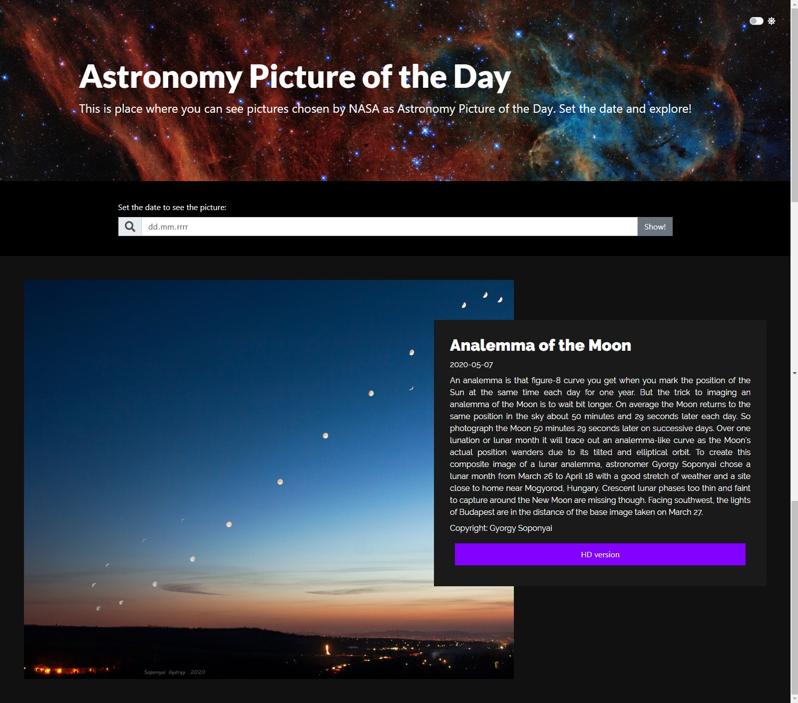
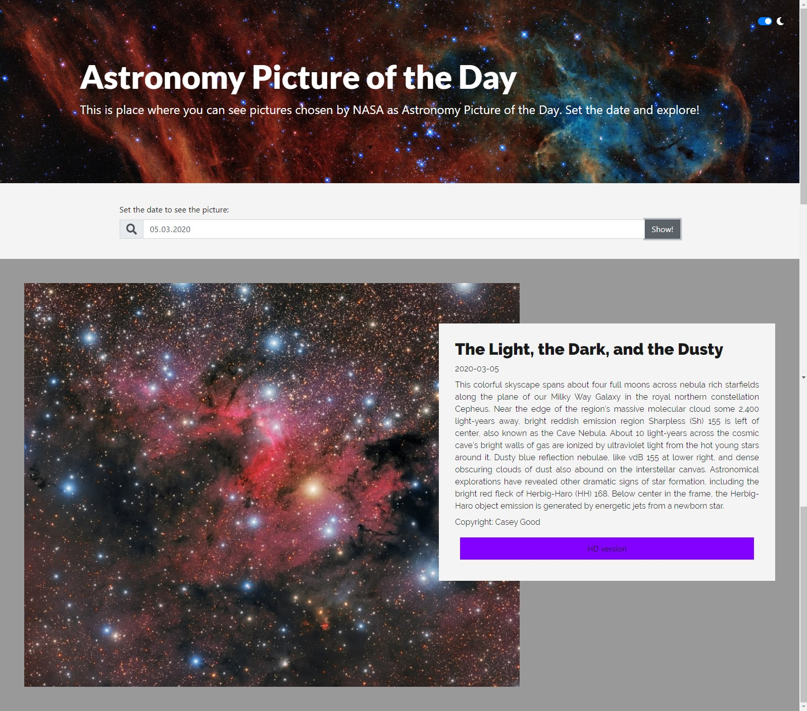

# NASA Explorer
> Astronomy Picture of the Day

## Table of contents
* [General info](#general-info)
* [Live](#live)
* [Screenshots](#screenshots)
* [Technologies](#technologies)
* [Setup](#available-scripts)
* [Features](#features)
* [Status](#status)
* [Inspiration](#inspiration)
* [Contact](#contact)

## General info
Based on NASA API website fetch data about chosen Picture of the Day. 

## Live
You can see live version here: https://sylwiasuwalska.github.io/nasa-explorer/

## Technologies
* ReactJS with Hooks, version 16.13.1
* React Bootstrap, version 1.0.1
* Styled Components, version 5.1.0
* React Transition Group, version 4.3.0
* axios
* moment.js
* waypoint

## Screenshots

## Available Scripts

In the project directory, you can run:

### `npm start`

Runs the app in the development mode. 
Open [http://localhost:3000](http://localhost:3000) to view it in the browser.

The page will reload if you make edits. 
You will also see any lint errors in the console.

### `npm test`

Launches the test runner in the interactive watch mode. 
See the section about [running tests](https://facebook.github.io/create-react-app/docs/running-tests) for more information.

## Features

* display picture of the Day
* dark/light mode
* validation of input data

To-do list:
* display pictures from last ten days
* saving favourite pictures
* user login to save favourite pictures
* tests

## Status
Project is in progress.

